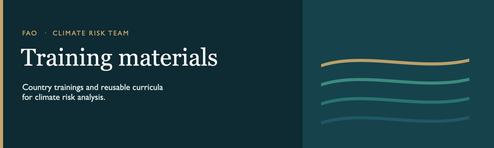
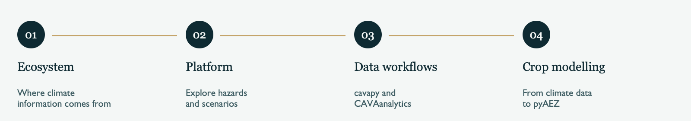

<p align="center">
  
</p>

This repository holds the training materials of the FAO Climate Risk Team. It brings together two kinds of work: **trainings delivered in countries**, and **curricula** that set out a course which can be taught again.

<table>
<tr>
<td width="72" valign="top"></td>
<td valign="top">

### Country trainings

Workshops and missions prepared for a specific place. Each country folder contains the agenda, presentations, exercises, and notes from that delivery.

</td>
</tr>
<tr>
<td width="72" valign="top"></td>
<td valign="top">

### Curricula

Structured training series: the learning path, session plans, slides, and practical exercises. A curriculum can include a worked country example, which stays inside that series.

</td>
</tr>
</table>

---

## Country trainings

| | Focus |
|---|---|
| **[Yemen](Yemen/)** | Building capacity for climate risk analysis in agriculture and related sectors. The workshop covers the CIPA framework, ocean–atmosphere and climate analysis, CAVA, and the Climate Risk Toolbox. |
| **[São Tomé and Príncipe](STP/)** | Climate change and its impacts on fisheries and tourism in a Blue Economy context, including adaptation recommendations and sectoral risk analytics. |

Each of these folders has its own README with the session agenda.

---

## Curricula

### CAVA Training Series

*From climate information to climate impact analysis.*

The series strengthens the capacity to access, interpret, and apply climate information through CAVA: the Platform, `cavapy`, `CAVAanalytics`, and the link onward to agricultural impact modelling.

<p align="center">
  
</p>

| Module | What participants learn |
|---|---|
| **1 · Ecosystem** | Why climate information is hard to use, where it comes from, and how the CAVA ecosystem turns model output into information for a decision. |
| **2 · Platform** | How to use the CAVA Platform to explore variables, indicators, scenarios, and uncertainty for a geography or a project. |
| **3 · Data workflows** | How to extract and analyse climate data in notebooks with `cavapy` and `CAVAanalytics`. |
| **4 · Crop modelling** | How CAVA outputs feed agricultural impact modelling with `pyAEZ`. |

Modules 1 and 2 are for a broad audience. Modules 3 and 4 are for people who work directly with data or crop models.

The [Pakistan package](CAVAtraining/PAK/) is the worked example for the series: a country presentation and notebooks on pre-monsoon heat.

Materials for the series live in [`CAVAtraining/`](CAVAtraining/).

---

## How the repository is arranged

```
.
├── CAVAtraining/          CAVA curriculum
│   ├── HQ/                Concept note, modules, and slides
│   └── PAK/               Pakistan worked example
├── STP/                   São Tomé and Príncipe training
└── Yemen/                 Yemen training
```

A new country training gets its own folder, named with the country or its ISO code, and a short README for the agenda. A new curriculum gets its own folder. Country examples that belong to a curriculum stay inside that folder. Name files so the session, topic, and version are clear.

Recordings, large climate extracts, and local slide-build files stay on disk. They are listed in [`.gitignore`](.gitignore).
